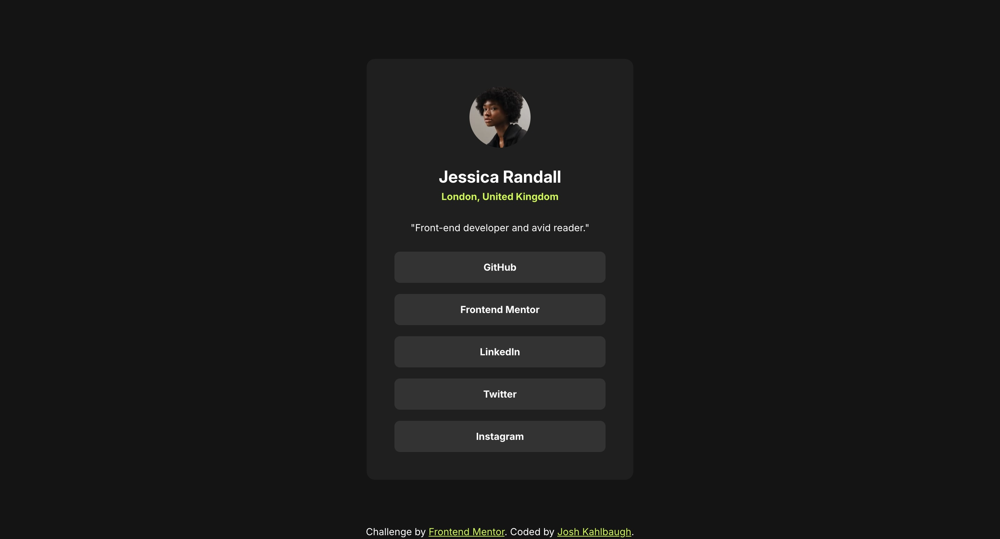

# Frontend Mentor - Social links profile solution

This is a solution to the [Social links profile challenge on Frontend Mentor](https://www.frontendmentor.io/challenges/social-links-profile-UG32l9m6dQ). Frontend Mentor challenges help you improve your coding skills by building realistic projects.

## Table of contents

-   [Overview](#overview)
    -   [The challenge](#the-challenge)
    -   [Screenshot](#screenshot)
    -   [Links](#links)
-   [My process](#my-process)
    -   [Built with](#built-with)
    -   [What I learned](#what-i-learned)
    -   [Continued development](#continued-development)
    -   [Useful resources](#useful-resources)
-   [Author](#author)

**Note: Delete this note and update the table of contents based on what sections you keep.**

## Overview

### The challenge

Users should be able to:

-   See hover and focus states for all interactive elements on the page

### Screenshot



### Links

-   Solution URL: [Solution](https://github.com/Joshk7/social-links-profile)
-   Live Site URL: [Live Site](https://social-links-profile-olive-chi.vercel.app)

## My process

I used vanilla html and css for this project. Firstly, I started by laying out the html tags to use. Then, I linked a css
file to style all the elements.

### Built with

-   Semantic HTML5 markup
-   CSS custom properties
-   Flexbox

**Note: These are just examples. Delete this note and replace the list above with your own choices**

### What I learned

I learned a little bit about media queries to make this project responsive for mobile and medium-sized devices.

```css
@media screen and (max-width: 48rem) {
    main {
        padding: 2.5rem;
    }

    .container {
        width: 28.5rem;
    }
}

@media screen and (max-width: 23.4375rem) {
    main {
        padding: 1.5rem;
    }

    .container {
        max-width: 20.4375rem;
        padding: 1.5rem;
    }
}
```

I don't quite know if this was the right way to go about it, but that's what I came up with.

### Continued development

I'd refine the media queries in the future especially for mobile, but this is a great start.

### Useful resources

-   [Resource on Media Queries](https://www.w3schools.com/css/css3_mediaqueries.asp) - This helped me think about how I wanted to layout my media queries at the end of my css file.

## Author

-   Website - [Josh Kahlbaugh](https://joshuakahlbaugh.pages.dev/)
-   Frontend Mentor - [@Joshk7](https://www.frontendmentor.io/profile/Joshk7)
